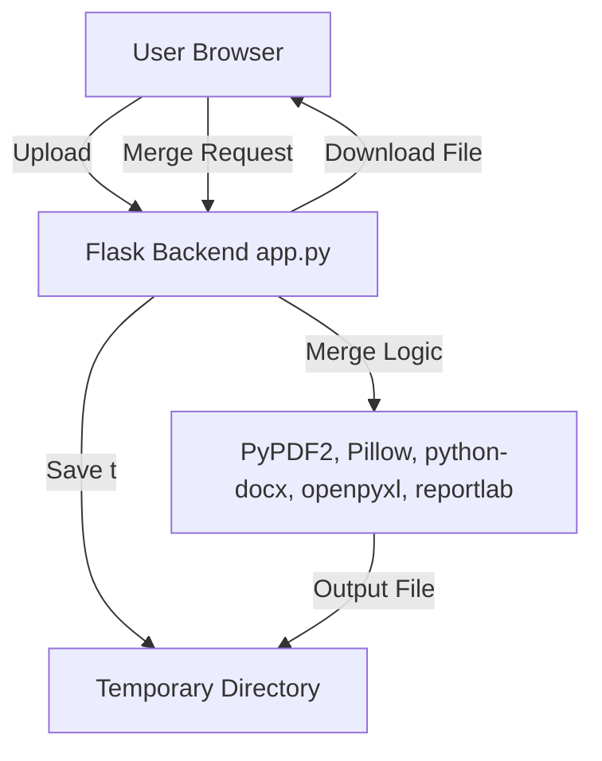
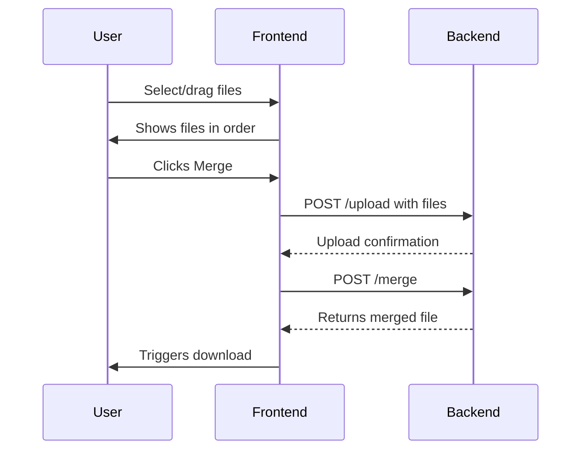

# 📄 Multi File Merger Web App — Documentation

This documentation covers the entire system for the Multi File Merger Web Application, including all source code, configuration files, and supporting scripts. The project enables users to upload and merge PDFs, images, Word, Excel, and text files, optionally exporting everything as a single PDF via a modern drag-and-drop UI.

---

## app.py

This file is the **main backend server** for the app. It uses **Flask** to provide endpoints for file upload and merging, handling various file types, and allowing downloads of merged documents.

### Key Concepts

- **APIs for upload/merge**
- **Temporary directory for files**
- **Supports PDF, images, DOCX, XLSX, TXT**
- **Can convert non-PDF merges to PDF**
- **CORS enabled for cross-origin requests**
- **Compatible with PyInstaller (for EXE builds)**
- **Returns merged files directly for download**

### Core Architecture



### Main Components

- **resource_path**: Handles file paths for PyInstaller.
- **UPLOAD/Temporary Directory**: All uploads are processed in memory in a temp folder.
- **ALLOWED_EXTENSIONS**: Only certain file types are accepted.
- **Endpoints**: `/`, `/upload`, `/merge` (see API blocks below).

---

### Endpoint: GET /

#### Serves the Frontend

This endpoint returns `index.html` when the user navigates to the root URL.

```api
{
    "title": "Serve Frontend",
    "description": "Returns the main HTML interface.",
    "method": "GET",
    "baseUrl": "http://127.0.0.1:5000",
    "endpoint": "/",
    "headers": [],
    "queryParams": [],
    "pathParams": [],
    "bodyType": "none",
    "requestBody": "",
    "responses": {
        "200": {
            "description": "Frontend HTML page",
            "body": "<!DOCTYPE html>..."
        }
    }
}
```

---

### Endpoint: POST /upload

#### Handles File Uploads

Uploads files to the server. Validates file types and stores files in a temporary directory. Ensures all files are of the same type.

```api
{
    "title": "Upload Files",
    "description": "Uploads one or more files of the same type for merging. Accepts PDFs, images, DOCX, XLSX, TXT.",
    "method": "POST",
    "baseUrl": "http://127.0.0.1:5000",
    "endpoint": "/upload",
    "headers": [
        {
            "key": "Content-Type",
            "value": "multipart/form-data",
            "required": true
        }
    ],
    "queryParams": [],
    "pathParams": [],
    "bodyType": "form",
    "requestBody": "",
    "formData": [
        {
            "key": "files",
            "value": "Files to upload (multiple allowed)",
            "required": true
        },
        {
            "key": "save_as_pdf",
            "value": "Set to 'true' to convert result to PDF",
            "required": false
        }
    ],
    "responses": {
        "200": {
            "description": "Success. Files uploaded.",
            "body": "{ \"message\": \"3 files uploaded successfully.\" }"
        },
        "400": {
            "description": "Bad request: wrong type or missing files.",
            "body": "{ \"error\": \"File not allowed: foo.exe\" }"
        },
        "500": {
            "description": "Server error during upload.",
            "body": "{ \"error\": \"Failed to save files.\" }"
        }
    }
}
```

---

### Endpoint: POST /merge

#### Merges Uploaded Files

Performs merging based on file type. Returns the merged document for direct download.

```api
{
    "title": "Merge Files",
    "description": "Merges previously uploaded files. Returns a single merged file, optionally as PDF.",
    "method": "POST",
    "baseUrl": "http://127.0.0.1:5000",
    "endpoint": "/merge",
    "headers": [],
    "queryParams": [],
    "pathParams": [],
    "bodyType": "none",
    "requestBody": "",
    "responses": {
        "200": {
            "description": "Merged file delivered as download.",
            "body": "binary merged file content"
        },
        "400": {
            "description": "Not enough files or unsupported type.",
            "body": "{ \"error\": \"Upload at least two files first.\" }"
        },
        "500": {
            "description": "Merge operation failed.",
            "body": "{ \"error\": \"Merge failed: ...\" }"
        }
    }
}
```

---

### Supported File Handling Details

- **PDF**: Uses PyPDF2 to concatenate.
- **Images (JPG/PNG)**: Uses Pillow to stack vertically or convert to PDF.
- **DOCX**: Uses python-docx to append elements.
- **XLSX**: Uses openpyxl to append rows.
- **TXT**: Concatenates text; can render to PDF using reportlab.

### Temporary Directory Management

- All uploads and intermediate files are stored in a securely managed temporary directory.
- Cleanup is registered on app exit using `atexit`.

---

### Key Code Snippets

#### File Upload Handler

```python
@app.route('/upload', methods=['POST'])
def upload_files():
    # Validates and stores all uploaded files in TEMP_DIR
```

#### Merge Handler

```python
@app.route('/merge', methods=['POST'])
def merge_files():
    # Merges files based on extension and returns the result
```

---

```card
{
    "title": "Same-Type Enforcement",
    "content": "All uploaded files must be of the same type for a merge session."
}
```

---

## app.spec

This file defines the **PyInstaller build specification** for turning the web app into a standalone Windows executable.

### Purpose

- Creates a bundled, single-file EXE for distribution.
- Includes `index.html` in the build.
- Disables the console window for a cleaner user experience.
- Supports UPX compression for smaller builds.

### Key Entries

| Field       | Description                                      |
|-------------|--------------------------------------------------|
| `Analysis`  | Source analysis for dependencies and resources   |
| `datas`     | Includes `index.html` in the built app           |
| `EXE`       | Configuration for the output Windows executable  |
| `console`   | `False` means no command console pops up         |

#### Example Spec Snippet

```python
a = Analysis(
    ['app.py'],
    datas=[('index.html', '.')],
    ...
)
exe = EXE(
    ...,
    console=False,
    ...
)
```

---

## index.html

This is the **main frontend UI** for the app, built with HTML, Tailwind CSS, and modern JavaScript. It provides a user-friendly, drag-and-drop interface for uploading and merging files.

### Features

- **Modern Card Layout**: Clean, centered card with rounded corners and shadow.
- **Drag & Drop Area**: Upload files by dragging or selecting via file picker.
- **File List**: Shows uploaded files, allows reordering and removal.
- **Checkbox**: Option to save output as PDF.
- **Merge Button**: Starts the upload and merge process.
- **Status/Download Area**: Shows operation status and offers download on completion.
- **Responsive**: Styled for mobile and desktop.

### UI/UX Flow



### Main JavaScript Logic

- **updateUI()**: Dynamically updates file list and UI state.
- **uploadFiles()**: Posts files to `/upload`.
- **triggerMerge()**: Requests merge, triggers file download.
- **handleMergeClick()**: Combines upload and merge logic.
- **moveFile/removeFile**: Allows user to reorder or remove files.

#### Example: File Upload and Merge JavaScript

```js
async function handleMergeClick() {
    if (isProcessing || uploadedFiles.length === 0) return;
    const uploadResult = await uploadFiles();
    if (!uploadResult) return;
    await triggerMerge();
}
```

---

```card
{
    "title": "Browser Compatibility",
    "content": "The app works in any modern browser, with a focus on Chrome and Edge."
}
```

---

## requirements.txt

This file lists all Python libraries required for the app.

| Package         | Purpose                          |
|-----------------|----------------------------------|
| Flask           | Web server and routing           |
| flask-cors      | CORS support for API access      |
| PyPDF2          | PDF merging                      |
| Pillow          | Image handling                   |
| python-docx     | DOCX file processing             |
| openpyxl        | XLSX file processing             |
| reportlab       | PDF generation from text         |
| pypandoc        | (Optional) Document conversion   |

#### Example

```txt
Flask
flask-cors
PyPDF2
Pillow
python-docx
openpyxl
reportlab
pypandoc
```

---

## README.md

The README provides **project overview, usage instructions, features, and screenshots**.

### Key Sections

- **Features**: Supported file types, UI/UX highlights.
- **Tech Stack**: Backend, frontend, libraries.
- **How to Run Locally**: Setup and launch instructions.
- **Screenshots**: Visual examples (paths: `screenshots/ui-home.png`, etc.).

#### Sample Usage

```bash
git clone https://github.com/yourusername/pdf-merger-app.git
cd pdf-merger-app
pip install -r requirements.txt
python app.py
```

#### If on Windows

- Double-click the provided batch file: `start_pdfmerge.bat`

---

## start_pdfmerge.bat

This **Windows batch script** simplifies launching the app for end-users.

### How it Works

- Prints a banner to the terminal.
- (Optional) Activates a virtual environment.
- Starts the Flask server in a new terminal window.
- Waits briefly, then opens the browser to [http://127.0.0.1:5000](http://127.0.0.1:5000).
- Displays a success message and waits for user to close.

#### Script Example

```batch
@echo off
title PDF Merge Server
REM Activate your Python environment if needed (uncomment below)
REM call venv\Scripts\activate
REM Start Flask server
start "" cmd /k "py -3.11 app.py"
REM Wait for server to start
timeout /t 3 >nul
REM Open browser
start http://127.0.0.1:5000
echo ✅ PDF Merge Server launched successfully!
pause
```

---

```card
{
    "title": "Windows EXE Builds",
    "content": "Use app.spec and PyInstaller to create a one-click desktop app version."
}
```

---

# Summary Table

| File               | Purpose/Role                                    |
|--------------------|-------------------------------------------------|
| **app.py**         | Flask backend, main API, merging logic          |
| **app.spec**       | PyInstaller config for desktop EXE builds       |
| **index.html**     | Frontend UI, drag-and-drop, merge controls      |
| **requirements.txt**| Python library dependencies                    |
| **README.md**      | Setup, usage, and overview documentation        |
| **start_pdfmerge.bat**| Windows startup script for the server        |

---

# Best Practices

- **Keep all files of the same type per merge session.**
- **Don’t upload confidential docs to public servers!**
- **Test new document types in a safe environment.**
- **Always use the provided batch file on Windows for easiest launch.**

---

```card
{
    "title": "Support & Extensibility",
    "content": "Easily extend to other file types or integrate in desktop apps!"
}
```

---